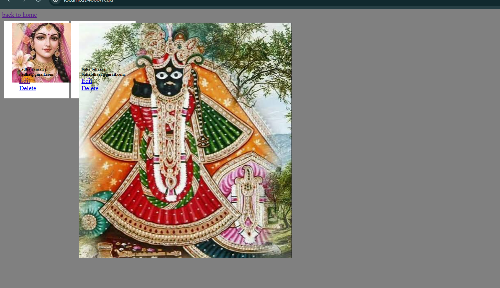

# CRUD Server-Side Rendering

A simple user-management CRUD application built with Express, MongoDB, Mongoose, and EJS. It renders pages on the server and lets you create, view, edit, and delete user records.

## Preview




## Features

- Create a user with a name, email address, and image URL.
- View all saved users on the `/read` page.
- Edit an existing user.
- Delete a user.
- Render HTML pages with EJS templates.

## Tech stack

- Node.js
- Express
- MongoDB
- Mongoose
- EJS
- CSS and Tailwind CSS (loaded from the CDN on the create and edit pages)

## Project structure

```text
CRUD_ServerSideRendering/
|-- app.js                 # Express routes and application setup
|-- models/Users.js        # MongoDB connection and User model
|-- views/                 # EJS templates
|-- public/                # Stylesheets and project images
`-- read.md                # Project documentation
```

## Requirements

- Node.js installed
- MongoDB running locally on port `27017`

## Installation and running

1. Install dependencies:

   ```bash
   npm install
   ```

2. Start MongoDB locally.

3. Start the application:

   ```bash
   node app.js
   ```

4. Open [http://localhost:4000](http://localhost:4000) in your browser.

The application currently connects to this local database:

```text
mongodb://127.0.0.1:27017/testDB1
```

## Routes

| Method | Route | Purpose |
| --- | --- | --- |
| GET | `/` | Shows the create-user form. |
| POST | `/create` | Saves a new user. |
| GET | `/read` | Displays all users. |
| GET | `/edit?email=<email>` | Shows the form for one user. |
| POST | `/edited` | Updates a user. |
| GET | `/delete?email=<email>` | Deletes a user. |

## User data

Each user document has the following fields:

```js
{
  name: String,
  email: String,
  image: String
}
```

`image` should contain a publicly accessible image URL so it can be displayed in the user list.
